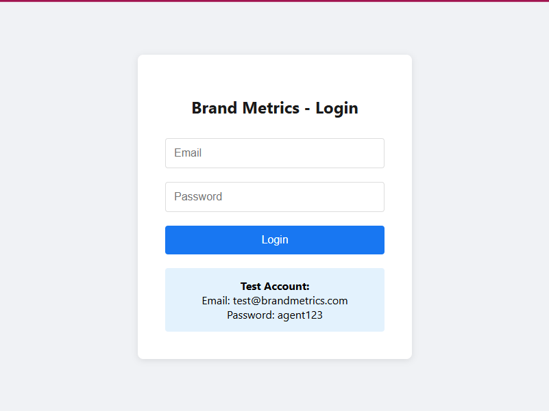

# Brand Metrics Agent Portal

A simple web application that allows agents to log in and access a chat interface for querying payroll information and customer order details.

## Features

- **Login System**: Email/password authentication
- **Chat Interface**: Simple chat-like interface for queries
- **Payroll Queries**: Ask about payroll for different time periods
- **Customer Orders**: Search for customer order information
- **Database**: SQLite with sample data

## 📸 Screenshots

### Login Page

*Secure login interface with test account credentials*

### Dashboard

*Main dashboard with sidebar navigation and chat interface*

### Chat Interface

*AI assistant chat with sample payroll query*

### Profile View

*User profile information and account details*

## Technology Stack

**Backend:**
- Node.js + Express
- SQLite database
- JWT authentication
- bcrypt password hashing

**Frontend:**
- React (JavaScript, no TypeScript)
- React Router for navigation
- Axios for API calls
- Inline CSS styling (no external libraries)

## Quick Start

1. **Install dependencies:**
   ```bash
   npm install
   cd client && npm install
   cd ..
   ```

2. **Create environment file:**
   ```bash
   cp env.example .env
   ```

3. **Start the application:**
   ```bash
   npm run dev
   ```

4. **Access the app:**
   - Frontend: http://localhost:3000
   - Backend: http://localhost:5000

## Test Account

- **Email**: `test@brandmetrics.com`
- **Password**: `agent123`

## Sample Queries

- "What's my payroll for this week?"
- "Show orders for John Smith"
- "Payroll this month"
- "Orders for customer Sarah Johnson"

## Project Structure

```
├── server/           # Backend API
├── client/           # React frontend
├── package.json      # Dependencies
└── README.md         # This file
```

## How It Works

1. **Authentication**: Users log in with email/password
2. **Chat Interface**: Users type questions in natural language
3. **NLP Processing**: Simple keyword detection for payroll and customer queries
4. **Database Queries**: Fetches relevant information from SQLite
5. **Response**: Returns formatted results to the user

## Security Features

- Password hashing with bcrypt
- JWT token authentication
- Input validation
- SQL injection protection

